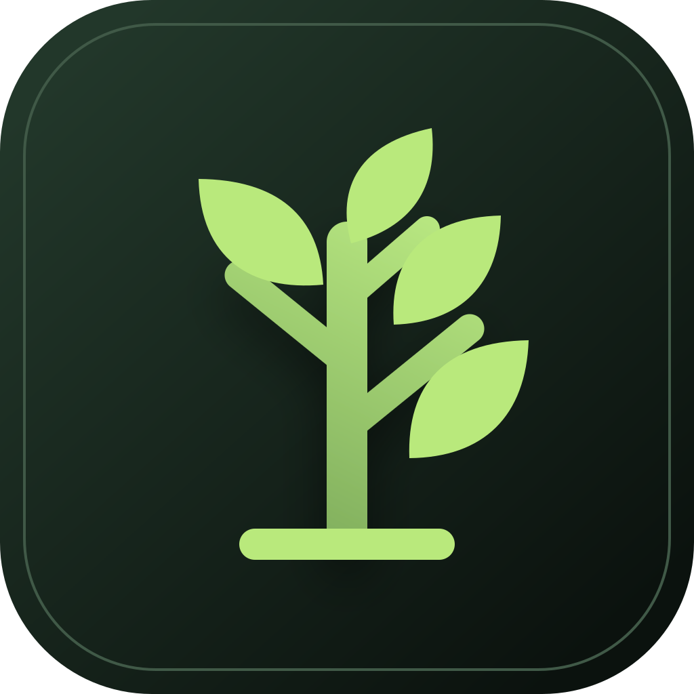

<div align="center">
  
  <h1>Grove</h1>
  <p><strong>A native macOS workspace for observing local coding-agent sessions.</strong></p>
</div>

Grove reads the local session history produced by Claude Code and Codex and
turns it into an inspectable tree and graphical agent map. It is designed for
developers who run several coding-agent sessions in separate terminals and
want one place to understand what is active, what is waiting, and how delegated
Claude Code agents relate to their parent sessions.

The entire application, including the UI, is written in Rust with
[GPUI](https://github.com/zed-industries/zed/tree/main/crates/gpui), the
GPU-accelerated UI framework used by Zed.

> [!IMPORTANT]
> Grove is currently an early macOS-only project. It observes Claude Code and
> Codex; it does not launch sessions, send prompts, or replace the terminal.

## Highlights

- Discovers Claude Code sessions under `~/.claude/projects`.
- Discovers Codex sessions under `~/.codex/sessions` and
  `~/.codex/archived_sessions`.
- Refreshes local session state every five seconds.
- Displays project, branch, title, recent activity, message count, and resume
  command.
- Infers `Working`, `Waiting`, and `Idle` from recent log activity.
- Provides both a text-oriented session tree and a graphical mind map.
- Connects sessions to direct and nested Claude Code subagents.
- Compacts large subagent fans into expandable, grouped agent clusters.
- Supports node dragging, persistent node positions, canvas panning, and zoom.
- Filters the tree and map by status.
- Switches the entire workspace between All, Claude Code, and Codex.
- Opens complete readable user/assistant message history on demand.
- Creates local groups without modifying Claude Code data.
- Handles malformed or partially unreadable session data without failing the
  entire scan.
- Supports macOS text input and IME composition.

## How it works

Grove is a read-only observer:

```text
~/.claude/projects/**/*.jsonl     ~/.codex/{sessions,archived_sessions}/**/*.jsonl
                 │                                      │
                 ▼                                      ▼
        Claude Code adapter                       Codex adapter
                 └──────────────────┬───────────────────┘
                                    ▼
                    sessions + supported subagents
                                    │
                              ┌─────┴─────┐
                              ▼           ▼
                         Tree view    Agent map
```

The agents' local JSONL formats are not treated as stable public APIs. Provider
adapters therefore parse records defensively, ignore unknown fields, report
partial failures, and keep agent-owned files read-only.

Session status is inferred rather than reported by either coding agent:

- **Working:** an unfinished turn has activity within the last 90 seconds.
- **Waiting:** a finished turn has activity within the last 15 minutes.
- **Idle:** neither of the above.

## Requirements

To use Grove:

- macOS 13 or newer
- Claude Code or Codex installed and used at least once, so local session
  history exists

To build Grove:

- Rust 1.95 or newer
- Xcode and the Xcode Command Line Tools
- Xcode Metal Toolchain

Install the Metal Toolchain once if it is unavailable:

```bash
xcodebuild -downloadComponent MetalToolchain
```

## Run from source

```bash
git clone https://github.com/gentamura/grove.git
cd grove
cargo run
```

Grove automatically watches the supported coding-agent data directories for
the current macOS user.

## Controls

### Tree view

| Action | Result |
|---|---|
| Select a session | Show its activity, metadata, and resume command |
| Search or select a status | Filter visible sessions |
| Select All, Claude, or Codex | Filter both Tree and Map by coding agent |
| Drag a session onto a group | Persist local group membership |
| Select **Messages** | Open the complete readable conversation history |

### Map view

| Action | Result |
|---|---|
| Click a session, cluster, or agent | Open its detail panel |
| Click empty canvas | Close the detail and Messages panels |
| Press `Escape` | Close Messages first, then the underlying detail panel |
| Drag a node | Reposition it and persist its offset |
| Hold `Space` and drag | Pan the canvas |
| Hold `Command` and scroll | Zoom around the pointer |
| Use `−`, `+`, or **Center** | Adjust or recenter the map |
| Expand a compact agent cluster | Show every grouped subagent as a clickable mini leaf |

## Verify changes

Run the full local verification suite before committing:

```bash
cargo fmt --all -- --check
cargo test
cargo clippy --all-targets -- -D warnings
```

Ignored smoke tests can read the current user's real local installations:

```bash
cargo test scans_installed_claude_sessions -- --ignored --nocapture
cargo test scans_installed_codex_sessions -- --ignored --nocapture
```

The smoke test is intentionally ignored by default because it depends on local,
private session history.

## Build the macOS app

```bash
./scripts/build-macos.sh
```

The script creates and ad-hoc signs:

```text
target/release/bundle/macos/Grove.app
```

This is a local development bundle. Distribution signing and notarization are
not implemented yet.

## Data and privacy

Grove:

- reads Claude Code session logs from `~/.claude/projects` and Codex rollout
  logs from `~/.codex/sessions` and `~/.codex/archived_sessions`;
- never writes to coding-agent files;
- does not read Claude Code or Codex account credentials;
- does not call the Anthropic or OpenAI APIs;
- stores Grove-owned grouping and map preferences at
  `~/Library/Application Support/Grove/preferences.json`.

Conversation content stays on the local machine unless the user separately
shares it.

## Project structure

```text
src/
├── main.rs          macOS application and window lifecycle
├── app.rs           GPUI state, tree view, map view, and interactions
├── scanner.rs       tolerant Claude Code and Codex JSONL adapters
├── models.rs        provider-aware, UI-independent session and agent models
├── preferences.rs   atomic local preference persistence
└── text_input.rs    native GPUI text input and IME behavior

assets/              application icon sources
docs/                requirements and architecture decisions
packaging/macos/     macOS bundle metadata
scripts/             local build and packaging scripts
```

## Documentation

- [Product requirements](docs/requirements.md)
- [Architecture decisions](docs/adr/README.md)
- [Licensing and distribution checklist](docs/licensing.md)
- [Coding-agent guide](AGENTS.md)
- [Claude Code guide](CLAUDE.md)

## Current limitations

- Grove cannot start, resume, or send messages to Claude Code or Codex.
- Status is based on log freshness, not process presence.
- Scans currently revisit the local session tree instead of incrementally
  tailing changed files.
- Codex internal subagent rollouts are excluded until their local metadata
  exposes a stable parent-session relationship.
- Only the observed local formats of Claude Code and Codex are supported.
- The macOS bundle is not signed for public distribution or notarized.
- Third-party notices are not bundled yet; complete the
  [binary distribution checklist](docs/licensing.md#distributing-a-binary)
  before publishing an official build.

## License

Grove's source code and documentation are available under the
[MIT License](LICENSE).

The Grove name and tree icon are not licensed under MIT. Unmodified official
builds may use and redistribute the icon, while modified versions and forks
must use different branding. See the
[Grove Brand and Trademark Policy](TRADEMARKS.md) and
[brand asset terms](assets/README.md).
